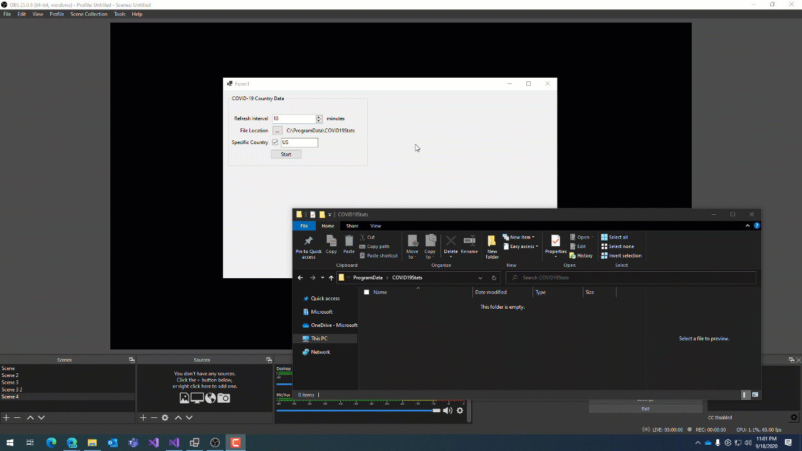

# Covid19Stats
Desktop app to retrieve COVID-19 Stats and download them to files on disk for OBS/SLOBS with a timer :)

Get data for all countries or for a specific country on a set interval that can be displayed in your stream by reading from a file.

Data from: https://about-corona.net/documentation

